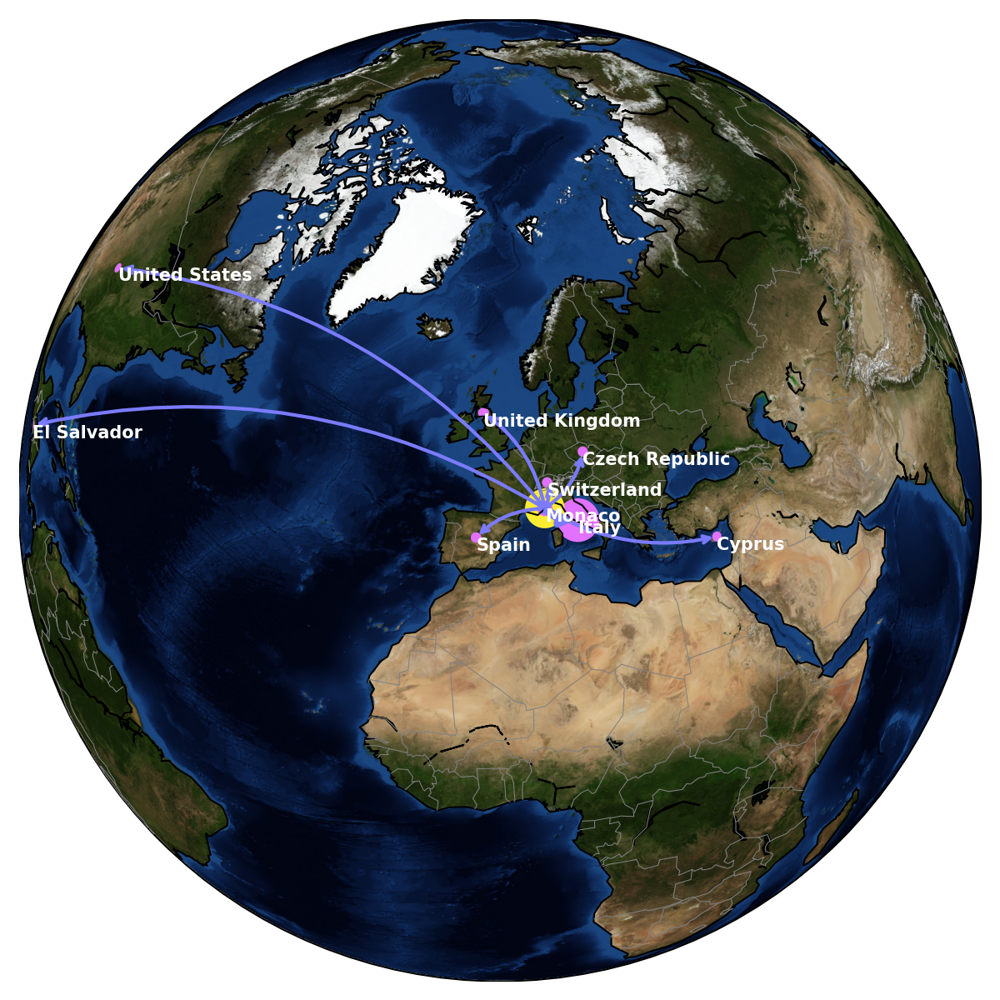
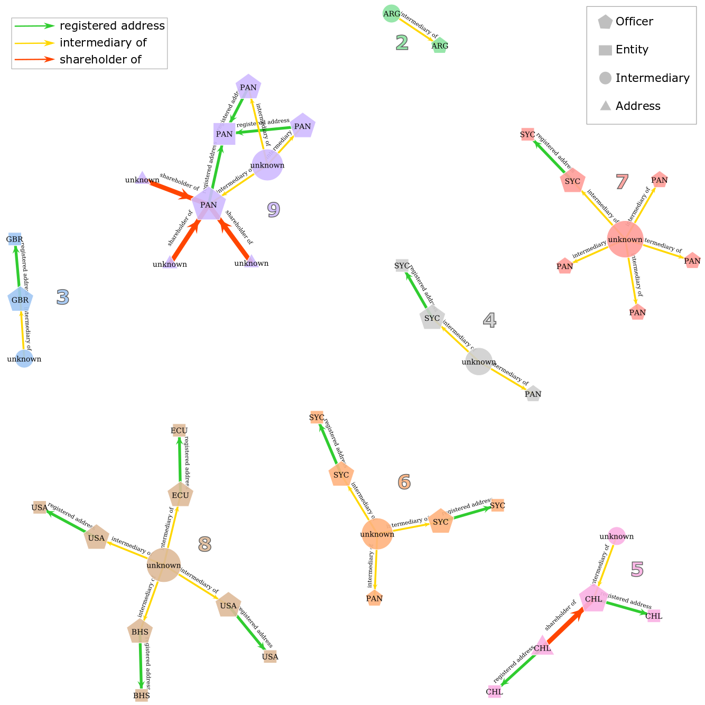

# Scripts for blogs on Medium

### https://link.medium.com/lxP32DUYi5

## 1. In the input folder are the spreedsheets. 
  * **Countries.csv** contains the location of different countries, it was used to draw the connection map.
  * **Component730nodes.npy, and Component730nodes_sfdp_edges.npy** are two numpy arrary files of node and edges information of an example discussed in my blog.  
  * For the Panama Papers database processed by me, please find them via the google drive link:https://drive.google.com/open?id=1_18uAbfS3lYywHMQwFClwWCBqWyQOASa.

## 2. In the code folder are a jupyter notebook and a python script. They describe the analysis I made for my medium blog.
  * **KG_panamapapers.ipynb** descibes my newtork analysis on the panama papers using networkx and other python libraries. Before one run this jupyter notebook on their own computer, please remember to check the dependencies (as whether one have all required python libraries installed) 
 

   
 

  * **Graph-tool_draw.py** descibes how I depict the network with graph-tool. If one want to run this script, please install the graph-tool first.
 

  
 

